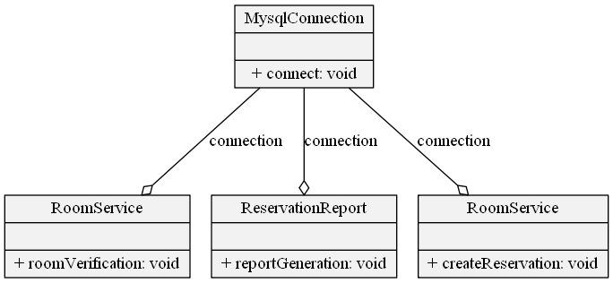

# Lecture1\Part2

## Problema inicial
Trocar o banco MySQL para Oracle

### Solução
- Criar classe Oracle
- Substituir instâncias da classe MySqlConnection

### Consequências da arquitetura antiga
Ter que trocar ``$this->connection = new MySqlConnection();`` em todas as classes necessárias

## Retorno esperado
```
string(19) "Connecting to Oracle"
string(31) "business logic over entity room"
string(19) "Connecting to Oracle"
string(44) "business logic in order to generate a report"
string(19) "Connecting to Oracle"
string(49) "business logic over the creation of a reservation"
```

## Concusão
O forte acoplamento ocorreu pois foi programado para uma classe concreta e nao uma interface


## Fast Foward
Todos ou a maioria dos 23 design patterns do GoF se baseiam em princípios simples, nos quais serão apresentados no decorrer das próximas aulas (antes dos padrões). Os 3 que serão visto são:
1. Programar para uma interface em detrimento de programar para uma implementação
2. Favorecimento de composição sobre herança
3. Encapsular o que varia
