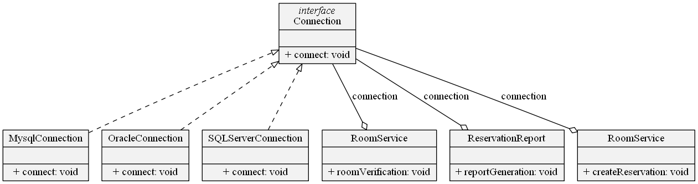

# Lecture1\Part3
## Retorno esperado
```
string(19) "Connecting to SQLServer"
string(31) "business logic over entity room"
string(19) "Connecting to SQLServer"
string(44) "business logic in order to generate a report"
string(19) "Connecting to SQLServer"
string(49) "business logic over the creation of a reservation"
```
## Conclusão


## Obs
- futuramente o pattern Factory ajudará no instanciamento de classes

## Concusão
- Agora que foi programado orientado a uma interface, na criação de uma nova conexão as models não precisam ser alteradas
- O código agora permite expansão, pois as classes Serviço estão desacopladas das classes de conexão
